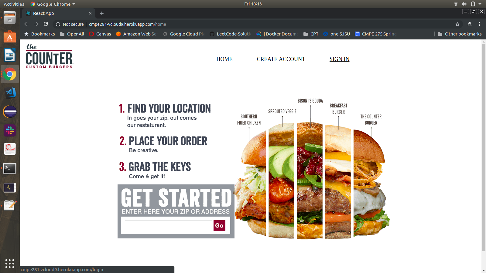

## Demo Screen Shots

#### 1. Open the application [Counter Burger](http://cmpe281-vcloud9.herokuapp.com/home)
 

#### 2. Login/Create Account using Sign in

#### 3. Login Success

#### 4. Select your restaurent

#### 5. See Menu to select items

#### 6. Select Food item from the menu

#### 7. Add to cart

#### 8. Review Cart

#### 8. Give payment details, To checkout

#### 9. Payment Success

## Configurations ScreenShots

#### GCP Configurations

##### 1. Instances

##### 2. Kubernetes Cluster

##### 3. Kubernetes Deployment

##### 4. Kubernetes Service Exposed

#### ECS Configuration

##### 1. ECS Cluster

##### 2. ECS Active Container Definition

#### RDS Configuration

##### 1. RDS Cluster

##### 2. RDS Database Config

#### Sharded MongoDB Configuration AWS Console

#### MongoDB Replica Set AWS Console

##### Data Distributed in Shards in Sharded MongoDB in GCP

